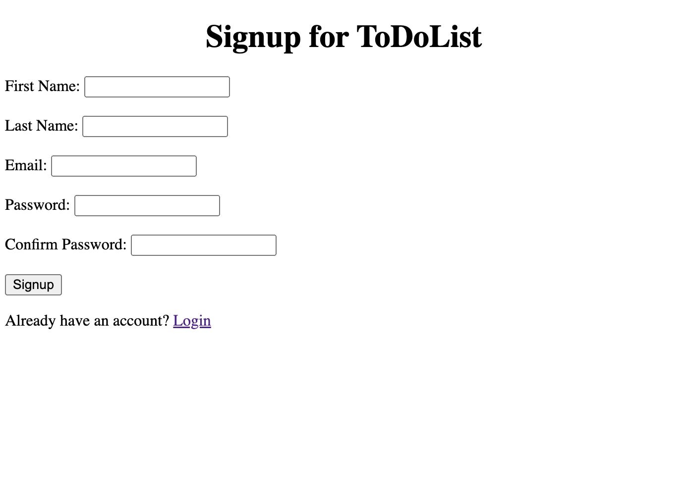

How to run this Django app:
The easiest way is by runnig `docker compose up` in the root director of the app

If you want to run it outside Docker, you can follow these steps:
1. Clone the repository
2. Create a virtual environment (Optional)
3. Install the dependencies using the command:
    `pip install -r requirements.txt`
4. Set up the database tables using the command:
    `python manage.py migrate`
5. Start the server at a specific host (eg, localhost) and port (eg, 8000) using the command:
    `python manage.py runserver localhost:8000`

In the browser, go to http://localhost:8000

This should redirect to the Login page:

Use the Signup button to go to the signup page and create an account:

After successfully logging in, the ToDo Lists page will be displayed:

A user can create more than one ToDo list and each list can have multiple tasks. To create a new list, enter a name in the text field and click the "Create" button. This will create a new ToDo list with not tasks.
Once a list is created, the name of the list can be changed by entering a new name in the corresponding text field and clicking the "Update List Name" button.
Similarly, a list can be deleted by clicking the "Delete List" button. All the tasks inside that list will also get deleted.
To see what tasks are present in a ToDo list, click the "View Task" button. This will redirect on a new page that will list all the tasks of the selected ToDo list.

Just like in the ToDo list page, a new task can be added to the list by entering a string in the text field and clicking the "Add" button.
The value of the task can be updated by entering the new value in the text field and clicking the "Update Task" button.
A task can be deleted using the "Delete Task" button

To mark a task as completed, use the "Mark as Completed" button. The value of a completed task cannot be updated. Hence, to edit the task, use the "Mark as Not Completed" button.

There is an option on the top of the page to go back to the ToDo List page or logout.
